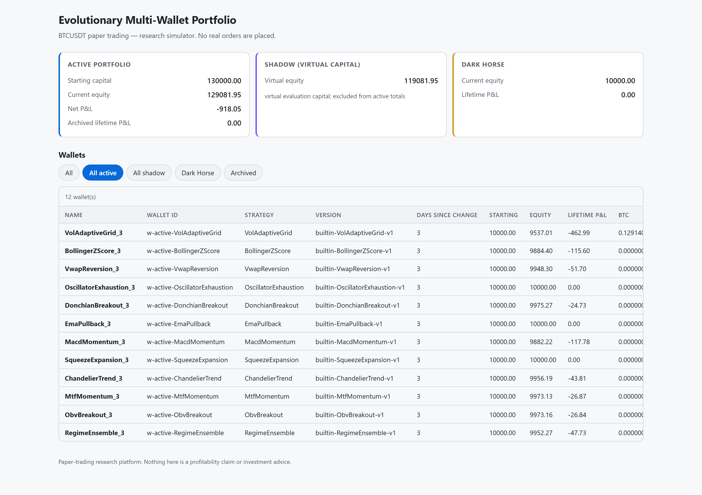
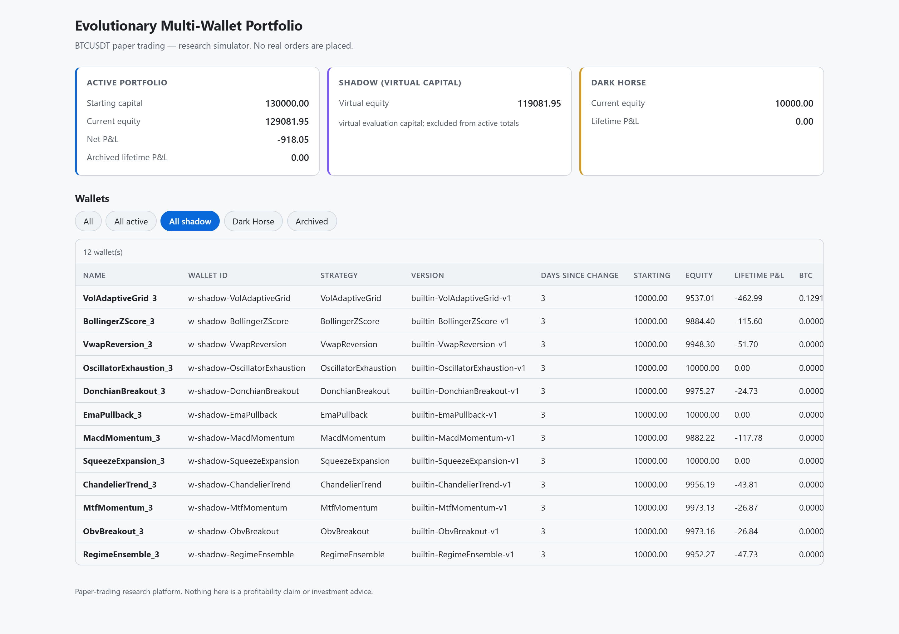
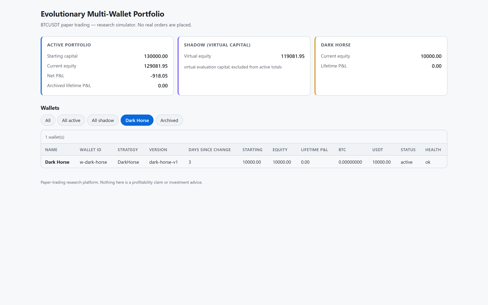
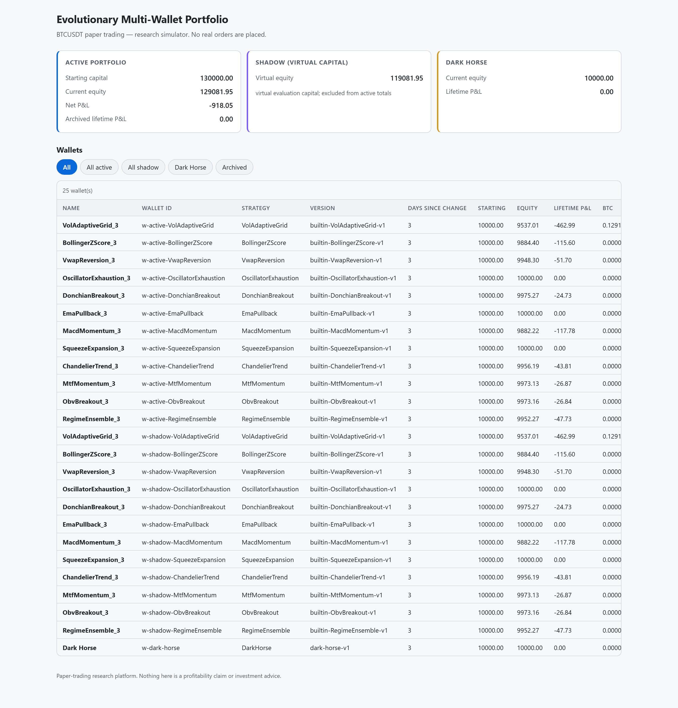

# Evolution — Product Evidence Showcase

*A personal, hands-on AI/agentic product build: a self-evolving, locally-run
paper-trading research platform where a local LLM writes the trading strategies,
the market eliminates them, and nothing — not the model, the data, or the
generated code — is trusted.*

**Author:** Khaled Elzarw · [linkedin.com/in/KhaledElzarw](https://linkedin.com/in/KhaledElzarw)
**Status:** Running live — trades every closed 5-minute BTCUSDT candle, refreshes
market awareness hourly, survives restarts. **Paper trading only**: no real
orders, no funds held, no profitability claims.

---

## What this demonstrates in 60 seconds

This is not a tutorial project. It is a running agentic system I designed, built,
and operate end to end — an evolutionary loop where AI-generated code competes
under hard rules and adversarial review:

| Product question | How this build answers it |
|---|---|
| **Where do agents apply judgment?** | A local llama.cpp model (Qwen3-VL-30B) autonomously writes and mutates trading strategies each week, and hourly synthesizes a **cited** market brief from CoinGecko, mempool.space, and news RSS. |
| **How is AI-generated code kept safe?** | Generated strategies are treated as **hostile**: never imported into a core process, executed in `python -I` sandboxes with hard timeouts and rlimits, filtered by a deny-by-default AST validator hardened after an independent verifier escaped the first version. |
| **How is quality forced, not hoped for?** | Weekly natural selection: rank by profit only, eliminate every loser and zero-trade strategy, permanently ban their code *and structure*, generate novel + mutated replacements, promote atomically. Novelty is enforced by a structural-similarity threshold. |
| **How is non-determinism controlled?** | Deterministic, bit-reproducible replay: the same seed produces identical ledgers; active/shadow wallets on the same strategy evolve identically; restart restores a versioned atomic snapshot and gap-replays instead of resetting. |
| **Is behaviour observable?** | Real-time dashboard: active vs. shadow vs. Dark Horse capital in visually distinct panels, live-trading status strip, market-awareness panel, per-wallet drill-down with price and performance charts. |
| **Is it engineered, not just demoed?** | **947 tests**, 97% coverage ratchet, 8 CI gates (incl. deterministic replay and security), Bandit/pip-audit clean, exact fixed-point money end to end, 0.62 ms tick for 24 wallets. |

## The evolutionary architecture

```
Binance public data (no API key)          CoinGecko · mempool.space · news RSS
        │                                              │
        ▼                                              ▼
┌─────────────────────────┐            ┌──────────────────────────────┐
│ LiveLoop / TickEngine   │            │ AwarenessService (hourly)    │
│ every closed 5m candle, │            │ deny-by-default DataBroker,  │
│ idempotent gap replay   │            │ local LLM writes cited brief │
└───────────┬─────────────┘            └──────────────┬───────────────┘
            ▼                                         ▼
┌─────────────────────────────────────────────────────────────────────┐
│ 25 competing wallets: 12 active + 12 shadow + permanent Dark Horse  │
│ sandboxed strategy subprocesses · exact decimal money · isolation   │
└───────────┬─────────────────────────────────────────────────────────┘
            ▼ weekly
┌─────────────────────────────────────────────────────────────────────┐
│ Evolution: rank by profit → eliminate & permanently ban → local LLM │
│ generates novel + mutated replacements → atomic promotion           │
└─────────────────────────────────────────────────────────────────────┘
```

Design choices worth noting:

- **Selection over supervision.** No committee vote or human judgment can save a
  losing strategy — profit is the only ranking value, enforced by schema
  validators, not convention.
- **The model is a code author, not a trader.** The LLM never touches an order.
  It writes strategy code that must survive AST validation, sandboxing, novelty
  checks, and then the market itself.
- **Fail-closed everywhere.** LLM down → platform reports degraded and keeps
  trading. Live data unfetchable → loud failure, never silent synthetic prices.
  Stale awareness brief → capped and replaced by an honest placeholder.
- **Money is exact.** `float` is rejected at the boundary in both the domain and
  the database; a flat round trip yields exactly `-(fees)`.

## Screenshots

| Active portfolio | Shadow (virtual capital) |
|---|---|
|  |  |

| Dark Horse | All 25 wallets |
|---|---|
|  |  |

## Lineage

Evolution grew out of an earlier build — a six-agent AI decisioning committee
(bear case, bull case, execution guard, grid risk, market regime, position risk)
advising a gated grid engine. That system's legacy modules still live in this
repo and its screenshots are in [`live_screenshots/`](live_screenshots/). The
lesson that shaped v2: advisory committees debate; selection pressure decides.

## Where to look

- [`README.md`](README.md) — setup, guarantees, security posture, honest status
- [`tradebot/application/`](tradebot/application/) — TickEngine, LiveLoop, AwarenessService, evolution
- [`tradebot/infrastructure/`](tradebot/infrastructure/) — sandbox runner, DataBroker, LLM client, state store
- [`docs/threat-model.md`](docs/threat-model.md) — why generated code is treated as hostile
- [`docs/audits/phase13-verification.md`](docs/audits/phase13-verification.md) — every defect independent verifiers found
- [`tests/`](tests/) — 947 tests incl. determinism, parity, and security suites
